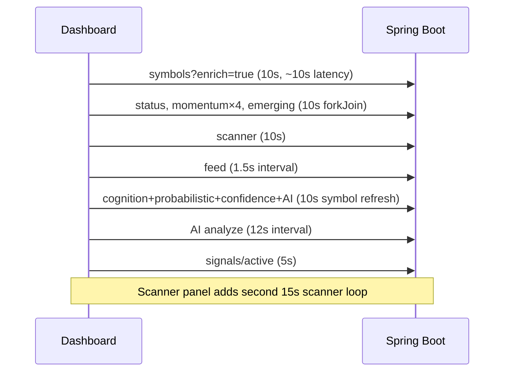
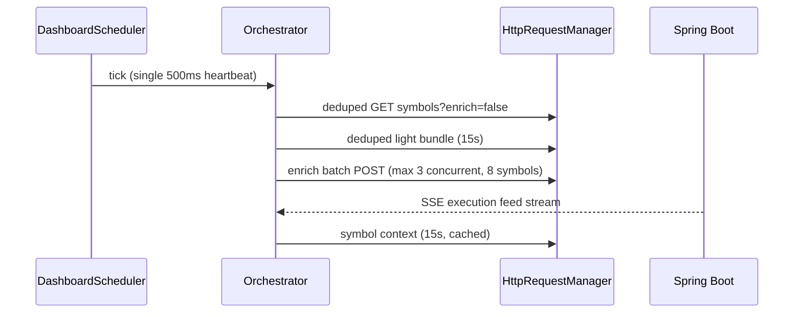

# Dashboard Network Architecture (Phase 170)

Production-grade request orchestration for the autonomous trading dashboard.

## Before vs After

### Before (problem)



~12+ requests / 10s, overlapping in-flight calls, 100+ pending XHR under load.

### After (target)



- One scheduler, visibility-aware intervals
- Shared cache + in-flight deduplication
- SSE feed with poll fallback when hidden or SSE error
- `enrich=false` default; progressive `POST /api/symbols/enrich`

## Frontend layout

```
frontend/src/app/services/
  network/
    api-cache.service.ts          # TTL cache
    http-request-manager.service.ts
    network-diagnostics.service.ts
    network-cache.config.ts
  dashboard/
    dashboard-scheduler.service.ts
    dashboard-scheduler.config.ts
    dashboard-state-store.service.ts
    dashboard-orchestrator.service.ts
    symbol-enrichment-queue.service.ts
```

## Priority tiers

| Tier | Interval (visible) | Tasks |
|------|-------------------|--------|
| High | 2–10s | Execution feed (SSE), active symbol, active signals |
| Medium | 12–30s | Light poll, scanner, heartbeat, symbol context |
| Low | 15s | AI execution analyze |
| Background | 60s | Journal, edge analytics, confidence refresh |

Hidden tab: intervals multiplied ×4.

## Anti-patterns removed

1. Six independent `interval()` loops in `DashboardComponent`
2. Duplicate scanner poll (dashboard 10s + panel 15s)
3. `refreshSignalContext()` on every 10s chart refresh (stacked with 12s AI loop)
4. `getSymbols(enrich=true)` on every light poll
5. `setInterval` feed poll without in-flight guard
6. Uncancelled overlapping symbol enrichment

## Migration

1. Dashboard calls `dashboardOrchestrator.start()` instead of multiple intervals
2. Components subscribe to `DashboardStateStore` / `RealTimeExecutionService.enriched$`
3. Remove `startPolling()` from child components; feed owned by orchestrator
4. Use `SymbolEnrichmentQueueService` for watchlist enrichment after symbol CRUD
5. Set `environment.showNetworkDiagnostics = false` in production

## APIs

| Method | Path | Notes |
|--------|------|-------|
| GET | `/api/symbols?enrich=false` | Default fast list |
| POST | `/api/symbols/enrich` | Body `{ symbols: string[] }`, max 8 |
| GET | `/api/execution/feed/stream` | SSE push ~1.5s |

## Performance goals

- Initial render: base symbols &lt; 1s
- &lt; 10 concurrent HTTP requests
- Zero duplicate in-flight keys per cache window
- No pending XHR queue buildup under normal use
